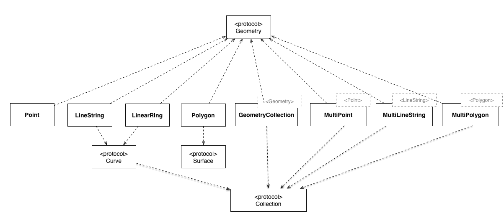

> :warning: **WARNING** :warning: The version in the `master` branch of this project is in a _prerelease_ state. There
> is active work going on that will result in API changes that can/will break code while things are finished.  Use with caution.
>
>  For a stable release, please use version [1.6.4](https://github.com/tonystone/geofeatures/releases/tag/1.6.4).  You can change the view of this repo to the stable version by using this [link](https://github.com/tonystone/geofeatures/tree/1.6.4).

# GeoFeatures 

<a href="https://github.com/tonystone/geofeatures/" target="_blank">
    
</a>
<a href="https://github.com/tonystone/geofeatures/" target="_blank">
    
</a>
<a href="https://github.com/tonystone/geofeatures/" target="_blank">
   
</a>
<a href="https://github.com/tonystone/geofeatures/" target="_blank">
   
</a>
<a href="https://github.com/tonystone/geofeatures/" target="_blank">
   
</a>
<a href="https://codecov.io/gh/tonystone/geofeatures">
   
</a>

## Introduction

GeoFeatures is a lightweight, high performance geometry library for Swift.  It supports the full set of geometric primitives such as Point, Polygon, and LineString as well as collection classes such as MultiPoint, MultiPolygon,and MultiLineString.



## Features
- [x] Easy to use.
- [x] Point, MultiPoint, LineString, MultiLineString, Polygon, MultiPolygon, Box and GeometryCollection implementations.
- [x] [WKT (Well-Known-Text)](https://en.wikipedia.org/wiki/Well-known_text) input and output.
- [x] [GeoJSON] (http://geojson.org/) input and output.
- [x] Indexed Subscripting support for all collection types (e.g. `Point * point = multiPoint[0]`).
- [x] **Swift**: Written in pure Swift.
- [x] CocoaPod framework support (compile as Objective-C framework or static lib).
- [x] Open Sourced under the the [Apache License, Version 2.0] (http://www.apache.org/licenses/LICENSE-2.0.html).

## Sources and Binaries

You can find the latest sources and binaries on [github] (https://github.com/tonystone/geofeatures).

## Communication and Contributions

- If you **need help**, use [Stack Overflow](http://stackoverflow.com/questions/tagged/geofeatures). (Tag 'geofeatures')
- If you would like to **ask a general question**, use [Stack Overflow](http://stackoverflow.com/questions/tagged/geofeatures). (Tag 'geofeatures')
- If you **found a bug**, _and can provide steps to reliably reproduce it_, [open an issue] (https://github.com/tonystone/geofeatures/issues).
- If you **have a feature request**, [open an issue] (https://github.com/tonystone/geofeatures/issues).
- If you **want to contribute**
   - Fork it! [GeoFeatures repository] (https://github.com/tonystone/geofeatures)
   - Create your feature branch: `git checkout -b my-new-feature`
   - Commit your changes: `git commit -am 'Add some feature'`
   - Push to the branch: `git push origin my-new-feature`
   - Submit a pull request :-)

## Installation

GeoFeatures is available through [CocoaPods](http://cocoapods.org). To install
it, simply add the following line to your Podfile:

```ruby
pod "GeoFeatures"
```

See the ["Using CocoaPods"](https://guides.cocoapods.org/using/using-cocoapods.html) guide for more information.

## Minimum Requirements

| Xcode | Swift | iOS |  OS X |
|:-----:|:-----:|:---:|:-----:|
| 8.0   |  3.0  | 8.0 | 10.10 |

## License

GeoFeatures is released under the [Apache License, Version 2.0] (http://www.apache.org/licenses/LICENSE-2.0.html)
